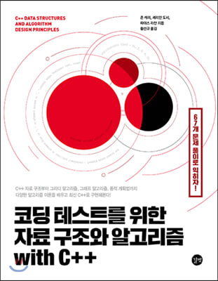

# Effective C++



# Reference

<dl>
    <dt>Title</dt> <dd>코딩 테스트를 위한 자료 구조와 알고리즘 with C++</dd>
    <dt>발행일</dt> <dd>2020-12-11</dd>
    <dt>지은이</dt> <dd>존 캐리, 세리안 도시, 파야스 라잔</dd>
    <dt>옮긴이</dt> <dd>황선규</dd>
    <dt>발행인</dt> <dd>이종원</dd>
    <dt>발행처</dt> <dd>(주)도서출판 길벗</dd>
</dl>

 
이미지 링크: <http://www.yes24.com/Product/Goods/95863013>
