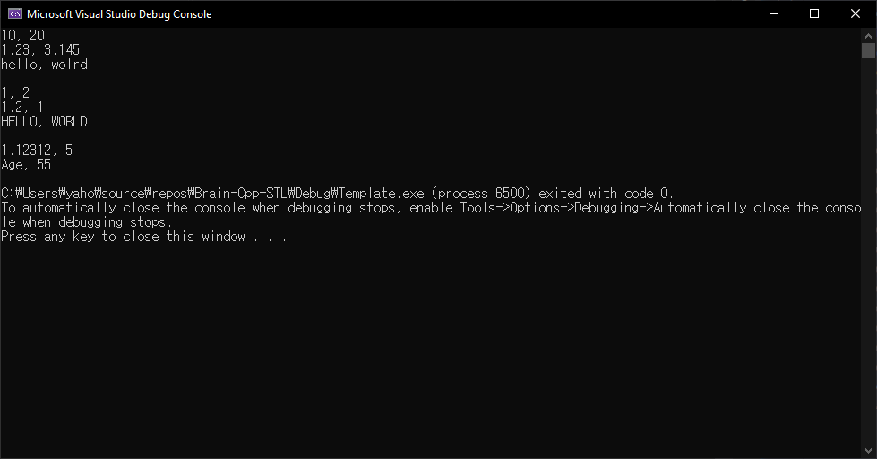
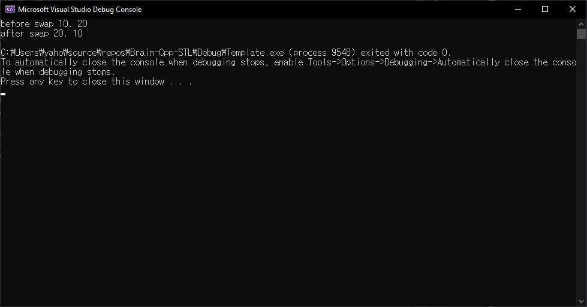
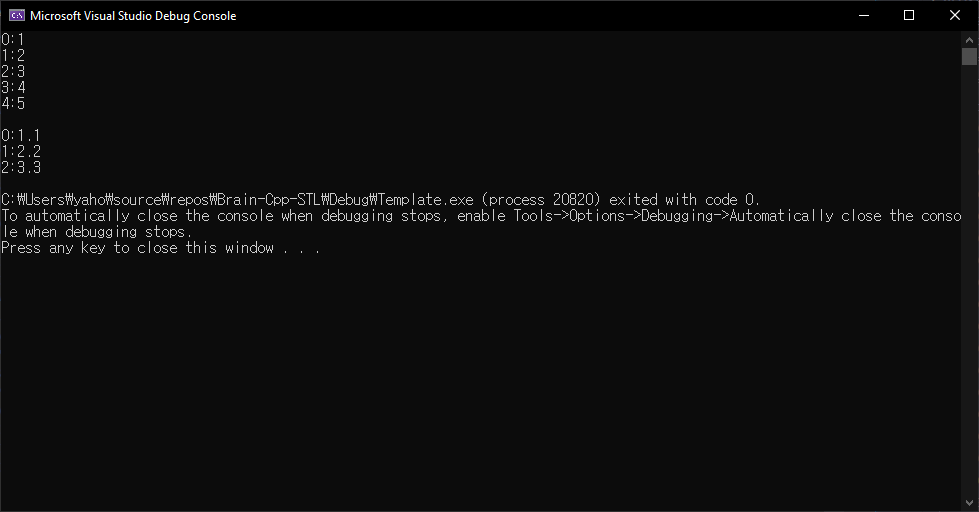
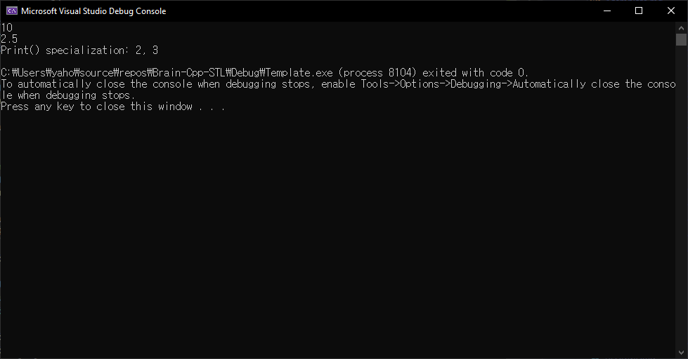
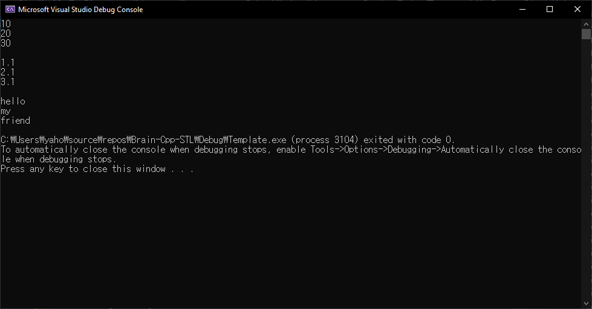

# 템플릿

```
템플릿은 STL 제너릭 프로그래밍의 핵심이다. 
템플릿은 컴파일 타임에 클라이언트가 여러 타입의 함수나 클래스를 쉽게 생성하게 한다. 
서버 코드 작성자는 좀 더 일반적인 프로그램 코드를 만들고 클라이언트가 구체적인 코드를 작성함으로써 제너릭한 프로그래밍이 가능해 집니다.

뭔 개소리야
```

- 함수 템플릿
	- 여러 함수를 만들어내는 함수의 틀
- 클래스 템플릿
	- 여러 클래스를 만들어내는 클래스의 틀

## 함수 템플릿

```cpp
#include <iostream>
using namespace std;

template<typename T>
void Print(T a, T b)
{
	cout << a << ", " << b << endl;
}

template<class T1, class T2>
void Print2(T1 a, T2 b)
{
	cout << a << ", " << b << endl;
}

int main()
{
	Print(10, 20);
	Print(1.23, 3.145);
	Print("hello", "wolrd");

	cout << endl;

	Print<int>(1, 2);
	Print<double>(1.2, 1);
	Print<const char*>("HELLO", "WORLD");

	cout << endl;

	Print2(1.123123, 5);
	Print2("Age", 55);

	return 0;
}
```



[x] `class` & `typename`
템플릿 지정 시 `template<typename T>` 또는 `template<class T>`로 사용할 수 있다. 현재 대부분의 컴파일러에서 두 형식을 모두 지원한다. (`template<class T>`형식은 C++ 표준화 이전부터 사용하던 형식)

```cpp
#include <iostream>
using namespace std;

template<typename T>
void Swap(T& a, T& b)
{
	T temp = a;
	a = b;
	b = temp;
}

int main()
{
	int n1 = 10;
	int n2 = 20;
	
	cout << "before swap "<< n1 << ", " << n2 << endl;
	Swap(n1, n2);
	cout << "after swap " << n1 << ", " << n2 << endl;

	return 0;
}
```



```cpp
#include <iostream>
using namespace std;

template<typename T, int size>
void PrintArray(T* arr)
{
	for (int i = 0; i < size; ++i)
	{
		cout << i << ":" << arr[i] << endl;
	}
}

int main()
{
	int arr1[5] = { 1,2,3,4,5 };
	double arr2[3] = { 1.1, 2.2, 3.3 };

	PrintArray<int, sizeof(arr1)/sizeof(int)>(arr1);
	cout << endl;
	PrintArray<double, sizeof(arr2)/sizeof(double)>(arr2);

	return 0;
}
```



```cpp
#include <iostream>
using namespace std;

class Point
{
	int x; int y;

public:
	explicit Point(int _x = 0, int _y = 0) : x(_x), y(_y) {}
	void Print() const { cout << x << ", " << y << endl; }
};

template<typename T>
void Print(T a)
{
	cout << a << endl;
}

// Point class를 위한 특수화 함수 템플릿
template<>
void Print(Point a)
{
	cout << "Print() specialization: ";
	a.Print();
}
int main()
{
	int n = 10;
	double d = 2.5;
	Point pt(2, 3);

	Print(n);
	Print(d);
	Print(pt);

	return 0;
}
```



## 클래스 템플릿

```cpp
#include <iostream>
#include <string>
using namespace std;

template<typename T>
class Array
{
public:
	explicit Array(int cap = 100) : buf(0), size(0), capa(cap)
	{
		buf = new T[capa];
	}
	~Array() { delete[]buf; }

	void Add(T data)
	{
		buf[size++] = data;
	}

	T operator[](int idx) const
	{
		return buf[idx];
	}

	int GetSize() const
	{
		return size;
	}

private:
	T* buf;
	int size;
	int capa;
};

int main()
{
	Array<int> nArr;
	nArr.Add(10);
	nArr.Add(20);
	nArr.Add(30);

	for (int i = 0; i < nArr.GetSize(); ++i)
	{
		cout << nArr[i] << endl;
	}
	cout << endl;

	Array<double> dArr;
	dArr.Add(1.1);
	dArr.Add(2.1);
	dArr.Add(3.1);

	for (int i = 0; i < dArr.GetSize(); ++i)
	{
		cout << dArr[i] << endl;
	}
	cout << endl;

	Array<string> sArr;
	sArr.Add("hello");
	sArr.Add("my");
	sArr.Add("friend");

	for (int i = 0; i < sArr.GetSize(); ++i)
	{
		cout << sArr[i] << endl;
	}

	return 0;
}
```



## STL을 위한 템플릿 예제