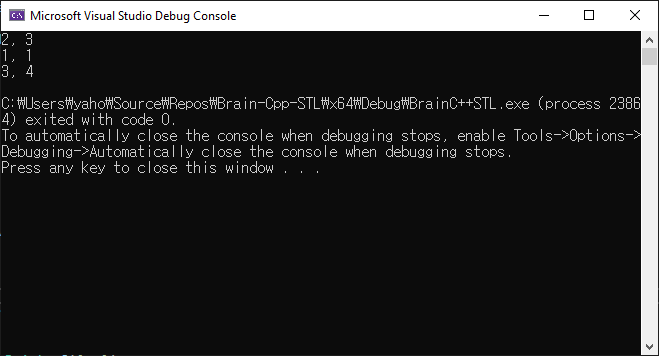
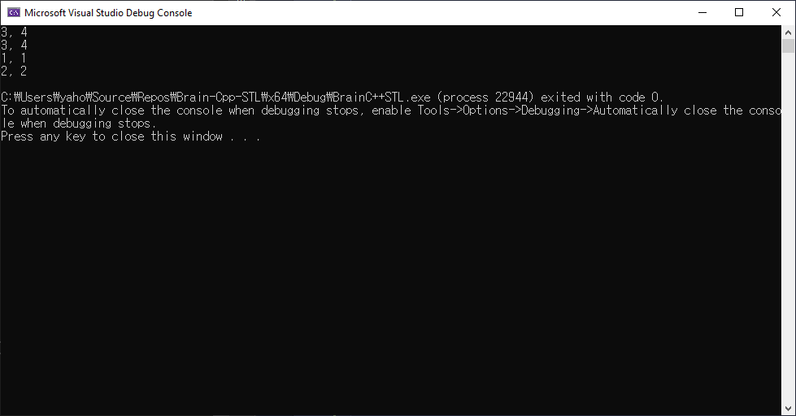

# 연산자 오버로딩

## 연산자 오버로딩이란

**연산자 오버로딩**은 사용자 클래스 타입에 C++ 연산자를 사용할 수 있게 하는 문법이다. **연산자 오버로딩**은 많은 STL 구성 요소(component)에 사용돼 쉽고 더 직관적이며 일반화된 코드를 만들어 낸다. :beginner:

## 연산자 오버로딩 정의 및 사용하기

```cpp
#include <iostream>
using namespace std;

class Point
{
public:
	Point(int x = 0, int y = 0) : mX(x), mY(y) {}
	void Print() const { cout << mX << ", "<< mY << endl; }
	const Point operator+(const Point& arg) const
	{
		Point pt;
		pt.mX = this->mX + arg.mX;
		pt.mY = this->mY + arg.mY;

		return pt;
	}

private:
	int mX;
	int mY;
};

int main()
{
	Point p1(2, 3);
	Point p2(1, 1);

	p1.Print();
	p2.Print();

	Point p3;
	p3 = p1 + p2;
	p3.Print();

	return 0;
}
```



```tip
자신의 멤버를 변경하지 않는 멤버 함수는 _(가능하다면)_ 모두 `const` 함수로!
```

---

## 단항 연산자 오버로딩

오버로딩이 가능한 단항 연산자: **_!_**, **_&_**, **_~_**, **_\*_**, **_+_**, **_-_**, **_++_** 등

```cpp
#include <iostream>
using namespace std;

class Point
{
public:
	Point(int x = 0, int y = 0) : mX(x), mY(y) {}
	void Print() const { cout << mX << ", " << mY << endl; }

	const Point& operator++() // 전위 ++ 연산자
	{
		++mX;
		++mY;
		return *this;

	}
	const Point& operator++(int) // 후위 ++ 연산자
	{
		Point pt(mX, mY);
		++mX;
		++mY;
		return pt;
	}

private:
	int mX;
	int mY;
};

int main()
{
	Point p1(2, 3);
	Point p2(1, 1);
	Point p3;

	p3 = ++p1;
	p3.Print();
	p1.Print();

	p3 = p2++;
	p3.Print();
	p2.Print();

	return 0;
}
```



---

## 이항 연산자 오버로딩

오버로딩이 가능한 이항 연산자: **_/_**, **_==_**, **_\*_**, **_+_**, **_-_**, **_!=_**, **_<_**, **_<=_** 등

```cpp
#include <iostream>
using namespace std;

class Point
{
public:
	Point(int x = 0, int y = 0) : mX(x), mY(y) {}
	void Print() const { cout << mX << ", " << mY << endl; }

	bool operator==(const Point& arg) const
	{
		return (mX == arg.mX && mY == arg.mY);
	}

	bool operator!=(const Point& arg) const
	{
		return !(*this == arg);
	}


private:
	int mX;
	int mY;
};

int main()
{
	Point p1(2, 3);
	Point p2(1, 1);
	Point p3 = p2;

	cout << (p3 == p2) << endl;
	cout << (p3 == p1) << endl;

	cout << (p3 != p2) << endl;
	cout << (p2 != p1) << endl;

	return 0;
}
```


## 전역 함수를 이용한 연산자 오버로딩

```cpp
#include <iostream>
using namespace std;

class Point
{
public:
	Point(int x = 0, int y = 0) : mX(x), mY(y) {}
	void Print() const { cout << mX << ", " << mY << endl; }

	// 멤버 함수 operator-
	//const Point& operator-(const Point& arg) const
	//{
	//	return Point(mX - arg.mX, mY - arg.mY);
	//}

	int GetX() const { return mX; }
	int GetY() const { return mY; }


private:
	int mX;
	int mY;
};

// 전역 함수 operator-
const Point& operator-(const Point& argL, const Point& argR)
{
	return Point(argL.GetX() - argR.GetX(), argL.GetY() - argR.GetY());
}

// user-defined operator- 전역 함수
template<class T>
const Point& operator-(const Point& argL, const T argR)
{
	return Point(argL.GetX() - argR, argL.GetY() - argR);
}

template<class T>
const Point& operator-(const T argL, const Point& argR)
{
	return Point(argR.GetX() - argL, argR.GetY() - argL);
}

int main()
{
	Point p1(100, 200);
	Point p2(1, 2);
	Point p3;
	Point p4;
	Point p5;
	const int val = 130;

	p3 = p1 - p2; // p3 = operator-(p1, p2);
	p3.Print();

	p4 = p1 - val;
	p4.Print();

	p5 = val - p1;
	p5.Print();

	return 0;
}
```


## STL에 필요한 주요 연산자 오버로딩

- **함수 호출** 연산자 `operator()`
  - `Func()`가 함수 이름 :point_right: **_함수 호출_**
  - `Func()`가 함수 포인터 :point_right: **_함수 포인터 호출_** 
  - `Func()`가 함수 객체 :point_right: **_함수 객체 호출_**

```cpp
#include <iostream>
using namespace std;

class FuncObject
{
public:
	void operator()(int arg) const
	{
		cout << "[멤버 함수] int: " << arg << endl;
	}

	void operator()(int arg1, int arg2) const
	{
		cout << "[멤버 함수] arg1: " << arg1 << ", " << "arg2: " << arg2 << endl;
	}

	void operator()(int arg1, int arg2, int arg3) const
	{
		cout << "[멤버 함수] arg1: " << arg1 << ", " << "arg2: " << arg2 << ", arg3: " << arg3 << endl;
	}
};

void Print1(int arg)
{
	cout << "[전역 함수] int: " << arg << endl;
}

int GetValue()
{
	return 10;
}

int main()
{
	FuncObject obj;
	obj(10); // 객체 생성 후 호출 (암시적)
	obj(10, 20);
	obj(10, 20, 30);
	cout << endl;

	obj.operator()(10); //객체 생성 후 호출 (명시적)
	obj.operator()(10, 20);
	obj.operator()(10, 20, 30);
	cout << endl;

	FuncObject()(10); // 임시 객체로 호출 (암시적)
	FuncObject()(10, 20);
	FuncObject()(10, 20, 30);
	cout << endl;

	FuncObject().operator()(10); // 임시 객체로 호출 (명시적)
	FuncObject().operator()(10, 20);
	FuncObject().operator()(10, 20, 30);
	cout << endl;

	void (*pPrint)(int) = Print1;
	Print1(1); // 함수를 사용한 정수 출력
	pPrint(1); // 함수 포인터를 사용한 정수 출력
	cout << endl;

	int (*pGetVal)() = GetValue;
	cout << "GetValue: " << GetValue() << endl;
	cout << "*pGetVal: " << pGetVal() << endl;

	return 0;
}
}
```


```note
- 명시적(explicit) 호출
- 암시적(implicit) 호출

[:link:](https://m.blog.naver.com/PostView.nhn?blogId=singerjyy&logNo=100093475608&proxyReferer=https:%2F%2Fwww.google.com%2F){: target="_blank"}
```

- **배열 인덱스** 연산자 `operator[]`

  - [] 연산자 오버로딩은 일반적으로 컨테이너 객체에 사용 (컨테이너 객체가 관리하는 내부 원소에 접근할 때)

```warning
very bad example :arrow_down:
```

```cpp
#include <iostream>
using namespace std;

class Array
{
public:
	Array(int cap = 100) : mArr(0), mSize(0), mCapacity(cap)
	{
		mArr = new int[mCapacity];
	}
	~Array() { delete[]mArr; }

	void Add(int data)
	{
		if (mSize < mCapacity)
		{
			mArr[mSize++] = data;
		}
	}

	int Capacity() const
	{
		return mCapacity;
	}

	int Size() const
	{
		return mSize;
	}

	int operator[](int idx) const
	{
		return mArr[idx];
	}

	int& operator[](int idx)
	{
		return mArr[idx];
	}

private:
	int* mArr;
	int mSize;
	int mCapacity;
};

int main()
{
	Array ar(10);
	ar[0] = 100;
	ar[1] = 200;
	ar[2] = 300;

	cout << ar[0] << ", " << ar[1] << ", " << ar[2] << endl;

	return 0;
}
```


- **메모리 접근, 클래스 멤버 접근** 연산자 `operator*`, `operator->`

	- **_*_**, **_->_** 연산자는 **스마트 포인터**나 **반복자(iterator)** 등의 특수한 객체에 사용

반복자는 STL의 핵심 구성 요소이므로 **_*_**, **_->_** 연산자 오버로딩 매우 중요!
{:.bg-yellow-dark}

```cpp
#include <iostream>
using namespace std;

class Point
{
public:
	Point(int x = 0, int y = 0) : mX(x), mY(y) {}
	void Print() const { cout << mX << ", " << mY << endl; }

private:
	int mX;
	int mY;
};

class PointPtr
{
public:
	PointPtr(Point* p) : mPtr(p) {}
	~PointPtr() { delete mPtr; }

	Point* operator->() const
	{
		return mPtr;
	}

	Point& operator*() const
	{
		return *mPtr;
	}

private:
	Point* mPtr;
};

int main()
{
	PointPtr p1 = new Point(1, 2);
	PointPtr p2 = new Point(5, 3);

	p1->Print();
	p2->Print();

	cout << endl;

	p1.operator->()->Print();
	p2.operator->()->Print();

	cout << endl;

	Point* p3 = new Point(10, 20);
	PointPtr p4 = new Point(30, 40);

	p3->Print();
	p4->Print();

	cout << endl;

	(*p3).Print();
	(*p4).Print(); // Point& operator*() related

	delete p3;

	return 0;
}
```


## 타입 변환 연산자 오버로딩

- 생성자를 이용한 타입 변환
	- 특정 타입을 인자로 받는 생성자가 있다면 생성자 호출을 통한 타입 변환(객체 생성 후 대입)이 가능
	- 생성자를 이용해 다른 타입을 자신의 타입으로 변환
- 타입 변환 연산자 오버로딩을 이용한 타입 변환
	- 자신의 타입을 다른 타입으로 변환

```cpp
#include <iostream>
using namespace std;

class A
{

};

class B
{
public:
	// 1.생성자를 이용한 타입 변환
	B() { cout << "B() constructor\n"; }
	B(A& val) { cout << "B(A&) constructor\n"; }
	B(int val) { cout << "B(int) constructor\n"; }
	B(double val) { cout << "B(double) constructor\n"; }
	
	// 2.타입 변환 연산자를 이용한 타입 변환
	// 타입 변환 연산자는 생성자나 소멸자와 같이 반환 타입을 지정하지 않음
	operator A()
	{
		cout << "operator A()\n";
		return A();
	}

	operator int()
	{
		cout << "operator int()\n";
		return 10;
	}

	operator double()
	{
		cout << "operator double()\n";
		return 5.5;
	}
};

int main()
{
	A a;
	int n = 10;
	double d = 5.5;
	B b;

	cout << endl;

	// 1.생성자를 이용한 타입 변환
	b = a;
	b = n;
	b = d;

	cout << endl;

	// 2.타입 변환 연산자를 이용한 타입 변환
	a = b;
	n = b;
	d = b;

	return 0;
}
```


---

# 마무리

```note
꼭! 알아두자

암시적인 생성자 형변환을 의도하지 않는 한 **_인자를 갖는 생성자는 모두 `explicit` 생성자로 만들자_**
```

```cpp
#include <iostream>
using namespace std;

class Point
{
public:
	Point(int x = 0, int y = 0) : mX(x), mY(y) {}
	void Print() const { cout << mX << ", " << mY << endl; }

private:
	int mX;
	int mY;
};

int main()
{
	Point p1(100, 200);
	Point p2 = 10; // Mistake but not error!

	p1.Print();
	p2.Print();

	return 0;
}
```

```danger

```

생성자에 `explicit` 키워드 추가 후

```cpp
#include <iostream>
using namespace std;

class Point
{
public:
	explicit Point(int x = 0, int y = 0) : mX(x), mY(y) {}
	void Print() const { cout << mX << ", " << mY << endl; }

private:
	int mX;
	int mY;
};

int main()
{
	Point p1(100, 200);
	Point p2 = 10; // error

	p1.Print();
	p2.Print();

	return 0;
}
```


---

## 문제 풀이
```cpp
#include <iostream>
#include <string.h>

using namespace std;

class String
{
public:
	String(const char* str) 
	{
		m_str = new char[256];
		strcpy_s(m_str, strlen(str)+1, str);
	}

	~String() 
	{ 
		cout << "~String()\n";
		delete []m_str; 
	}

	operator const char* () const
	{
		cout << "operator const char* () const " << m_str << endl;
		return m_str;
	}
	
	operator char* ()
	{
		cout << "operator char* () " << m_str << endl;
		return m_str;
	}

	char* operator=(const char* str)
	{
		cout << "char* operator=(const char* str) " << endl;
		strcpy_s(m_str, strlen(str) + 1, str);
		return m_str;
	}

private:
	char* m_str;
};

int main()
{
	String s4("Hello");
	const char* sz4 = s4;

	cout << "sz4: " << sz4 << endl;

	const char* sz5 = "Hello!";
	String s5("Hi!");

	cout << "s5(1): " << s5 << endl;
	
	s5 = sz5;

	cout << "s5(2): " << s5 << endl;

	return 0;
}
```

