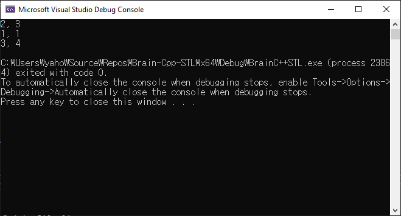
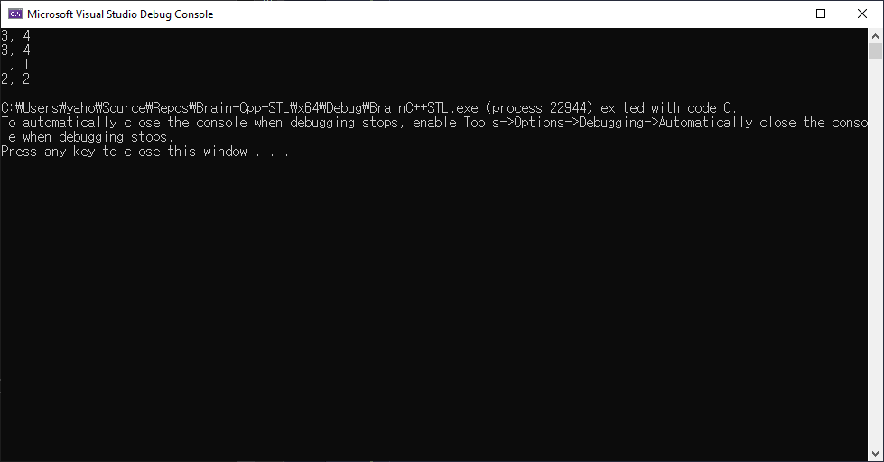
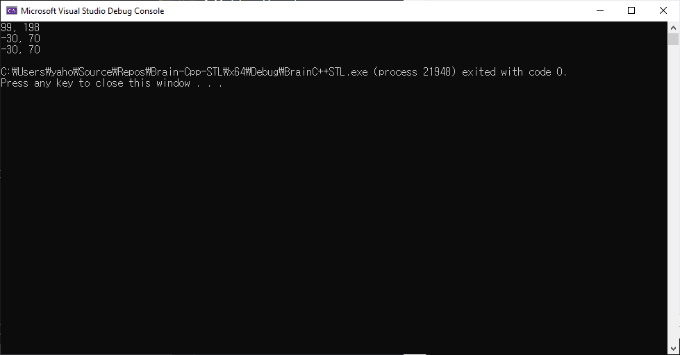
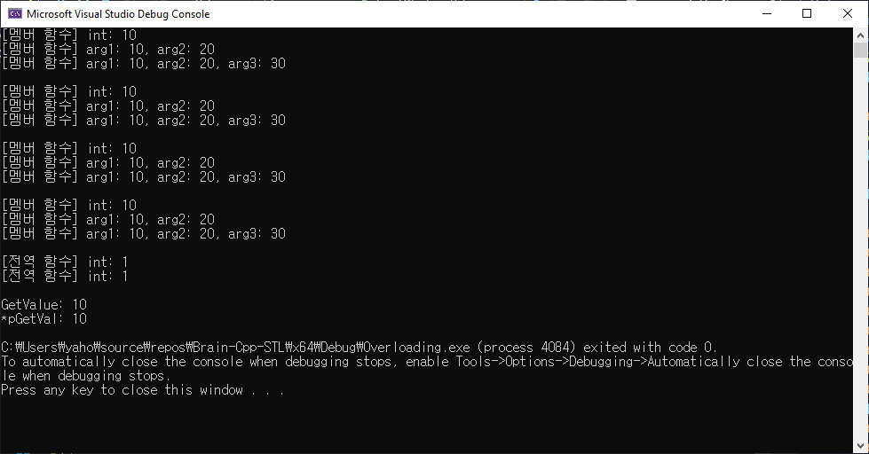

# 연산자 오버로딩
## 연산자 오버로딩이란

## 연산자 오버로딩 정의 및 사용하기

```cpp
#include <iostream>
using namespace std;

class Point
{
public:
	Point(int x = 0, int y = 0) : mX(x), mY(y) {}
	void Print() const { cout << mX << ", "<< mY << endl; }
	const Point operator+(const Point& arg) const
	{
		Point pt;
		pt.mX = this->mX + arg.mX;
		pt.mY = this->mY + arg.mY;

		return pt;
	}

private:
	int mX;
	int mY;
};

int main()
{
	Point p1(2, 3);
	Point p2(1, 1);

	p1.Print();
	p2.Print();

	Point p3;
	p3 = p1 + p2;
	p3.Print();
	
	return 0;
}
```



```tip
자신의 멤버를 변경하지 않는 멤버 함수는 (가능하다면) 모두 const 함수로!
```

---

## 단항 연산자 오버로딩

오버로딩이 가능한 단항 연산자: **_!_**, **_&_**, **_~_**, **_*_**, **_+_**, **_-_**, **_++_**, **_--_**

```cpp
#include <iostream>
using namespace std;

class Point
{
public:
	Point(int x = 0, int y = 0) : mX(x), mY(y) {}
	void Print() const { cout << mX << ", " << mY << endl; }

	const Point& operator++() // 전위 ++ 연산자
	{
		++mX;
		++mY;
		return *this;

	}
	const Point& operator++(int) // 후위 ++ 연산자
	{
		Point pt(mX, mY);
		++mX;
		++mY;
		return pt;
	}

private:
	int mX;
	int mY;
};

int main()
{
	Point p1(2, 3);
	Point p2(1, 1);
	Point p3;

	p3 = ++p1;
	p3.Print();
	p1.Print();

	p3 = p2++;
	p3.Print();
	p2.Print();

	return 0;
}
```


---

## 이항 연산자 오버로딩

오버로딩이 가능한 이항 연산자: **_/_**, **_==_**, **_*_**, **_+_**, **_-_**, **_!=_**, **_<_**, **_<=_** 등

```cpp
#include <iostream>
using namespace std;

class Point
{
public:
	Point(int x = 0, int y = 0) : mX(x), mY(y) {}
	void Print() const { cout << mX << ", " << mY << endl; }

	bool operator==(const Point& arg) const
	{
		return (mX == arg.mX && mY == arg.mY);
	}
	
	bool operator!=(const Point& arg) const
	{
		return !(*this == arg);
	}


private:
	int mX;
	int mY;
};

int main()
{
	Point p1(2, 3);
	Point p2(1, 1);
	Point p3 = p2;

	cout << (p3 == p2) << endl;
	cout << (p3 == p1) << endl;

	cout << (p3 != p2) << endl;
	cout << (p2 != p1) << endl;

	return 0;
}
```


## 전역 함수를 이용한 연산자 오버로딩

```cpp
#include <iostream>
using namespace std;

class Point
{
public:
	Point(int x = 0, int y = 0) : mX(x), mY(y) {}
	void Print() const { cout << mX << ", " << mY << endl; }

	// 멤버 함수 operator-
	//const Point& operator-(const Point& arg) const
	//{
	//	return Point(mX - arg.mX, mY - arg.mY);
	//}

	int GetX() const { return mX; }
	int GetY() const { return mY; }


private:
	int mX;
	int mY;
};

// 전역 함수 operator-
const Point& operator-(const Point& argL, const Point& argR)
{
	return Point(argL.GetX() - argR.GetX(), argL.GetY() - argR.GetY());
}

// user-defined operator- 전역 함수
template<class T>
const Point& operator-(const Point& argL, const T argR)
{
	return Point(argL.GetX() - argR, argL.GetY() - argR);
}

template<class T>
const Point& operator-(const T argL, const Point& argR)
{
	return Point(argR.GetX() - argL, argR.GetY() - argL);
}

int main()
{
	Point p1(100, 200);
	Point p2(1, 2);
	Point p3;
	Point p4;
	Point p5;
	const int val = 130;

	p3 = p1 - p2; // p3 = operator-(p1, p2);
	p3.Print();

	p4 = p1 - val;
	p4.Print();

	p5 = val - p1;
	p5.Print();

	return 0;
}
```



## STL에 필요한 주요 연산자 오버로딩

- **함수 호출** 연산자 `operator()`
	- 함수 호출 - `Func()`가 함수 이름
	- 함수 포인터 - `Func()`가 함수 포인터
	- 함수 객체 - `Func()`가 함수 객체

```cpp
#include <iostream>
using namespace std;

class FuncObject
{
public:
	void operator()(int arg) const
	{
		cout << "[멤버 함수] int: " << arg << endl;
	}

	void operator()(int arg1, int arg2) const
	{
		cout << "[멤버 함수] arg1: " << arg1 << ", " << "arg2: " << arg2 << endl;
	}

	void operator()(int arg1, int arg2, int arg3) const
	{
		cout << "[멤버 함수] arg1: " << arg1 << ", " << "arg2: " << arg2 << ", arg3: " << arg3 << endl;
	}
};

void Print1(int arg)
{
	cout << "[전역 함수] int: " << arg << endl;
}

int GetValue()
{
	return 10;
}

int main()
{
	FuncObject obj;
	obj(10); // 객체 생성 후 호출 (암시적)
	obj(10, 20);
	obj(10, 20, 30);
	cout << endl;

	obj.operator()(10); //객체 생성 후 호출 (명시적)
	obj.operator()(10, 20);
	obj.operator()(10, 20, 30);
	cout << endl;

	FuncObject()(10); // 임시 객체로 호출 (암시적)
	FuncObject()(10, 20);
	FuncObject()(10, 20, 30);
	cout << endl;

	FuncObject().operator()(10); // 임시 객체로 호출 (명시적)
	FuncObject().operator()(10, 20);	 
	FuncObject().operator()(10, 20, 30);
	cout << endl;

	void (*pPrint)(int) = Print1;
	Print1(1); // 함수를 사용한 정수 출력
	pPrint(1); // 함수 포인터를 사용한 정수 출력
	cout << endl;

	int (*pGetVal)() = GetValue;
	cout << "GetValue: " << GetValue() << endl;
	cout << "*pGetVal: " << pGetVal() << endl;

	return 0;
}
}
```



```tip
명시적 할당 (Explicit Assignment)
암시적 할당 (Implicit Assignment)
```

- **배열 인덱스** 연산자 `operator[]`

	- [] 연산자 오버로딩은 일반적으로 컨테이너 객체에 사용 (컨테이너 객체가 관리하는 내부 원소에 접근할 때)

- **메모리 접근, 클래스 멤버 접근** 연산자 `operator*`

- **메모리 접근, 클래스 멤버 접근** 연산자 `operator->`

## 타입 변환 연산자 오버로딩

```note

```

# 함수 포인터

# 함수 객체

# 템플릿
