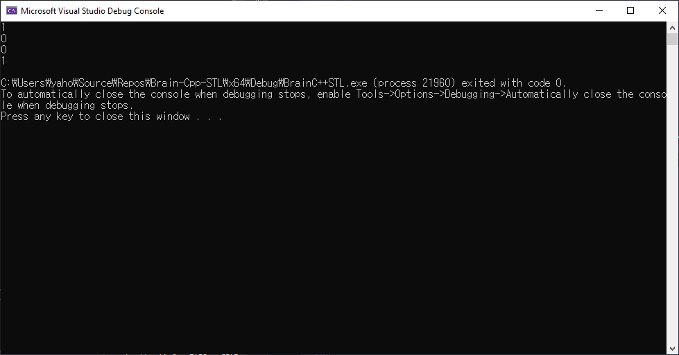

# 연산자 오버로딩
## 연산자 오버로딩이란
## 연산자 오버로딩 정의 및 사용하기

```cpp
#include <iostream>
using namespace std;

class Point
{
public:
	Point(int x = 0, int y = 0) : mX(x), mY(y) {}
	void Print() const { cout << mX << ", "<< mY << endl; }
	const Point operator+(const Point& arg) const
	{
		Point pt;
		pt.mX = this->mX + arg.mX;
		pt.mY = this->mY + arg.mY;

		return pt;
	}

private:
	int mX;
	int mY;
};

int main()
{
	Point p1(2, 3);
	Point p2(1, 1);

	p1.Print();
	p2.Print();

	Point p3;
	p3 = p1 + p2;
	p3.Print();
	
	return 0;
}
```


```tip
자신의 멤버를 변경하지 않는 멤버 함수는 (가능하다면) 모두 const 함수로!
```

---

## 단항 연산자 오버로딩

오버로딩이 가능한 단항 연산자: **_!_**, **_&_**, **_~_**, **_*_**, **_+_**, **_-_**, **_++_**, **_--_**

```cpp
#include <iostream>
using namespace std;

class Point
{
public:
	Point(int x = 0, int y = 0) : mX(x), mY(y) {}
	void Print() const { cout << mX << ", " << mY << endl; }

	const Point& operator++() // 전위 ++ 연산자
	{
		++mX;
		++mY;
		return *this;

	}
	const Point& operator++(int) // 후위 ++ 연산자
	{
		Point pt(mX, mY);
		++mX;
		++mY;
		return pt;
	}

private:
	int mX;
	int mY;
};

int main()
{
	Point p1(2, 3);
	Point p2(1, 1);
	Point p3;

	p3 = ++p1;
	p3.Print();
	p1.Print();

	p3 = p2++;
	p3.Print();
	p2.Print();

	return 0;
}
```


---

## 이항 연산자 오버로딩

오버로딩이 가능한 이항 연산자: **_/_**, **_==_**, **_*_**, **_+_**, **_-_**, **_!=_**, **_<_**, **_<=_** 등

```cpp
#include <iostream>
using namespace std;

class Point
{
public:
	Point(int x = 0, int y = 0) : mX(x), mY(y) {}
	void Print() const { cout << mX << ", " << mY << endl; }

	bool operator==(const Point& arg) const
	{
		return (mX == arg.mX && mY == arg.mY);
	}
	
	bool operator!=(const Point& arg) const
	{
		return !(*this == arg);
	}


private:
	int mX;
	int mY;
};

int main()
{
	Point p1(2, 3);
	Point p2(1, 1);
	Point p3 = p2;

	cout << (p3 == p2) << endl;
	cout << (p3 == p1) << endl;

	cout << (p3 != p2) << endl;
	cout << (p2 != p1) << endl;

	return 0;
}
```



## 전역 함수를 이용한 연산자 오버로딩

## STL에 필요한 주요 연산자 오버로딩

## 타입 변환 연산자 오버로딩

```note

```

# 함수 포인터

# 함수 객체

# 템플릿
