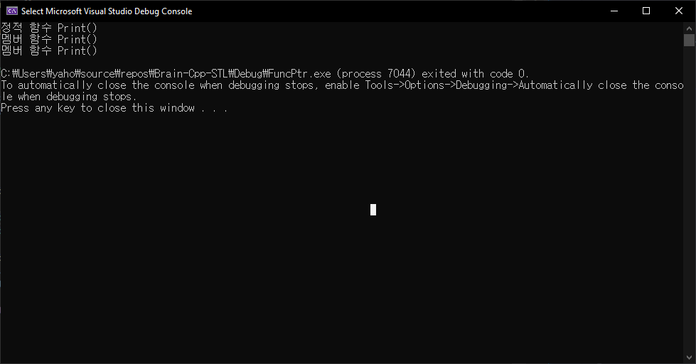

# 함수 포인터

## 함수 포인터란

- 함수의 시작 주소를 저장하는 포인터

```cpp
#include <iostream>
using namespace std;

void Print(int n)
{
	cout << "int: " << n << endl;
}

int main()
{
	void (*pf)(int);
	pf = Print;

	Print(10);
	pf(10);
	(*pf)(10);

	cout << endl;
	cout << Print << endl;
	cout << pf << endl;
	cout << *pf << endl;
	
	return 0;
}
```


```tip
함수 포인터는 메모리 접근 연산자 (`*`)를 붙여도 함수의 주소다. 따라서 `pf()`나 `(*pf)()`는 같은 문장이다.
```

## 함수 포인터의 종류

1. 정적 함수 호출 (정적 함수)
2. 객체로 멤버 함수 호출 (멤버 함수)
3. 객체의 주소로 멤버 함수 호출 (멤버 함수)

```cpp
#include <iostream>
using namespace std;

void Print()
{
	cout << "정적 함수 Print()" << endl;
}

class Point
{
public:
	void Print()
	{
		cout << "멤버 함수 Print()" << endl;
	}
};

int main()
{
	Point pt;
	Point* pPt = &pt;

	Print();      // 1. 정적 함수 호출
	pt.Print();   // 2. 객체로 멤버 함수 호출
	pPt->Print(); // 3. 주소로 멤버 함수 호출
	
	return 0;
}
```




```note
정적 함수: 전역 함수, namespace 내의 전역 함수, static 멤버 함수
```

## 클라이언트 코드와 서버 코드