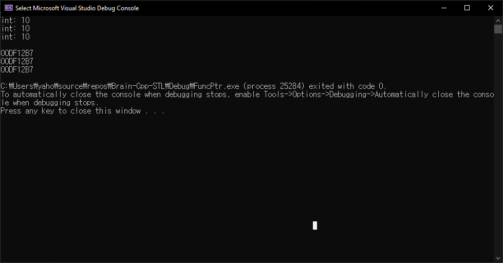
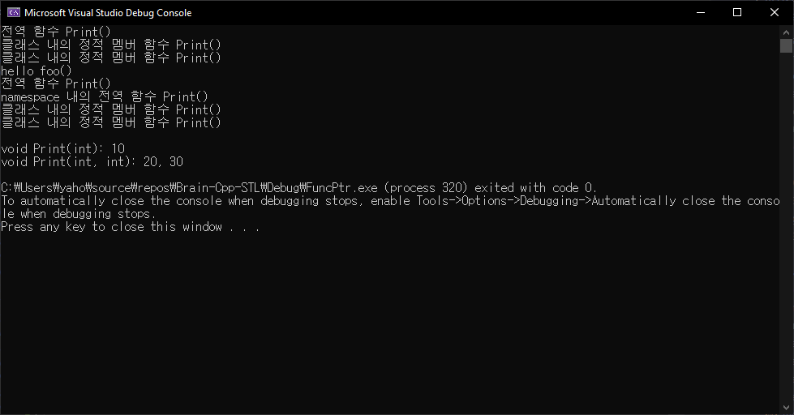

# 함수 포인터

## 함수 포인터란

- 함수의 시작 주소를 저장하는 포인터

```tip
[함수 포인터를 사용하는 이유](https://aossuper8.tistory.com/36){: target="_blank"}
```

```cpp
#include <iostream>
using namespace std;

void Print(int n)
{
	cout << "int: " << n << endl;
}

int main()
{
	void (*pf)(int);
	pf = Print;

	Print(10);
	pf(10);
	(*pf)(10);

	cout << endl;
	cout << Print << endl;
	cout << pf << endl;
	cout << *pf << endl;
	
	return 0;
}
```



```tip
함수 포인터는 메모리 접근 연산자 (`*`)를 붙여도 함수의 주소다. 따라서 `pf()`나 `(*pf)()`는 같은 문장이다.
```

## 함수 포인터의 종류

1. 정적 함수 호출 (정적 함수)
2. 객체로 멤버 함수 호출 (멤버 함수)
3. 객체의 주소로 멤버 함수 호출 (멤버 함수)

```cpp
#include <iostream>
using namespace std;

void Print()
{
	cout << "전역 함수 Print()" << endl;
}

void foo()
{
	cout << "hello foo()\n";
}

namespace myname
{
	void Print()
	{
		cout << "namespace 내의 전역 함수 Print()" << endl;
	}
}

class MyClass
{
public:
	static void Print()
	{
		cout << "클래스 내의 정적 멤버 함수 Print()" << endl;
	}
	
	void Print(int v1, int v2)
	{
		cout << "void Print(int, int): " << v1 << ", " << v2 << endl;
	}
	void Print(int val)
	{
		cout << "void Print(int): "<< val << endl;
	}
};

int main()
{
	MyClass c;
	MyClass* pC = &c;

	Print();     // 1. 정적 함수 호출
	c.Print();   // 2. 객체로 멤버 함수 호출
	pC->Print(); // 3. 주소로 멤버 함수 호출

	void (*pFunc)();
	pFunc = foo;
	pFunc();
	pFunc = Print;
	pFunc();
	pFunc = myname::Print;
	pFunc();
	pFunc = MyClass::Print;
	pFunc();
	pFunc = &MyClass::Print;
	pFunc();
	
	cout << endl;
	void (MyClass:: * pf1)(int);
	void (MyClass:: * pf2)(int, int);

	pf1 = &MyClass::Print;
	pf2 = &MyClass::Print;

	(c.*pf1)(10);
	(c.*pf2)(20,30);

	return 0;
}
```




```note
정적 함수: 전역 함수, namespace 내의 전역 함수, static 멤버 함수
```

## 클라이언트 코드와 서버 코드